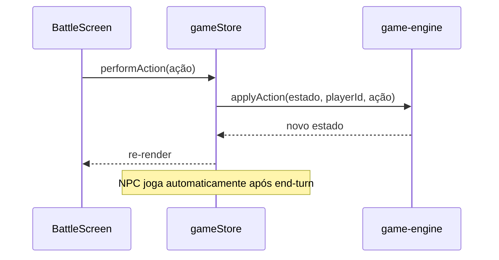
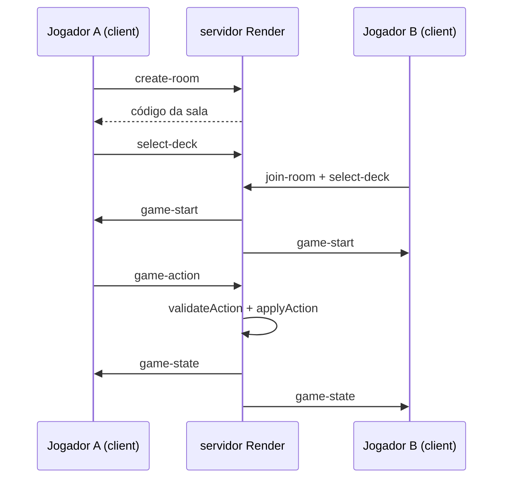

# Beyond the Veil — Guia do Projeto (LOTM TCG)

Documentação didática de como o jogo foi construído, como fazer deploy, como jogar com amigo, e o que ainda está planejado.

---

## Índice

1. [Visão geral](#1-visão-geral)
2. [Arquitetura do repositório](#2-arquitetura-do-repositório)
3. [URLs de produção](#3-urls-de-produção)
4. [Desenvolvimento local](#4-desenvolvimento-local)
5. [Deploy do client (GitHub Pages)](#5-deploy-do-client-github-pages)
6. [Deploy do servidor (Render)](#6-deploy-do-servidor-render)
7. [Multiplayer — como funciona](#7-multiplayer--como-funciona)
8. [Modo história e progressão](#8-modo-história-e-progressão)
9. [Arte das cartas](#9-arte-das-cartas)
10. [Ajustes de mobile](#10-ajustes-de-mobile)
11. [Variáveis de ambiente](#11-variáveis-de-ambiente)
12. [Problemas comuns (troubleshooting)](#12-problemas-comuns-troubleshooting)
13. [Roadmap planejado](#13-roadmap-planejado)
14. [Histórico de decisões técnicas](#14-histórico-de-decisões-técnicas)

---

## 1. Visão geral

**Beyond the Veil** é um TCG inspirado em *Lord of the Mysteries*, com:

- Partidas **solo vs NPC** (prática e modo história)
- Partidas **PvP online** com código de sala (multiplayer com amigo)
- Coleção, decks e progressão (via **Supabase**, quando configurado)
- Client como **PWA** (funciona bem no celular)

O repositório é um **monorepo** gerenciado com **pnpm**.

---

## 2. Arquitetura do repositório

```
lotm-tcg/
├── packages/
│   ├── client/          # React + Vite + Tailwind (interface do jogo)
│   ├── game-engine/     # Regras, cartas, batalha (TypeScript puro)
│   └── server/          # Express + Socket.IO (salas PvP e API)
├── scripts/             # Geradores de prompts para arte (IA)
├── docs/                # Documentação (este arquivo)
└── .github/workflows/   # CI: deploy automático do client
```

### Papéis de cada pacote

| Pacote | Responsabilidade |
|--------|------------------|
| `game-engine` | Fonte da verdade das regras: `createGame`, `applyAction`, `validateAction`, cartas, pathways, história |
| `client` | Telas, animações, stores Zustand, conexão Socket.IO, Supabase |
| `server` | Salas multiplayer, sincronização de estado, validação server-side |

### Fluxo de dados (PvE local)



### Fluxo de dados (PvP online)



---

## 3. URLs de produção

| Serviço | URL | O que hospeda |
|---------|-----|----------------|
| **GitHub Pages** | https://lochesystem.github.io/lotm-tcg/ | Client estático (HTML/JS/CSS) |
| **Render** | https://lotm-tcg.onrender.com | Servidor Node + WebSocket |
| **Health check** | https://lotm-tcg.onrender.com/health | Status do servidor (`{"status":"ok","rooms":0}`) |

> O jogo no celular usa **só** o GitHub Pages para a interface. O multiplayer precisa **também** do servidor no Render.

---

## 4. Desenvolvimento local

### Pré-requisitos

- Node.js 20+
- pnpm 9+

### Instalar e rodar

```bash
cd lotm-tcg
pnpm install

# Client + servidor juntos
pnpm dev

# Ou separado:
pnpm dev:client   # http://localhost:5173/lotm-tcg/
pnpm dev:server   # http://localhost:3001
```

### Supabase (opcional)

Copie `packages/client/.env.example` para `packages/client/.env` e preencha:

```env
VITE_SUPABASE_URL=https://seu-projeto.supabase.co
VITE_SUPABASE_ANON_KEY=sua-chave-anon
```

Sem Supabase, o jogo roda em **modo offline** com coleção local.

### Multiplayer local (dois jogadores na mesma rede)

1. Descubra o IP da máquina que roda o servidor (ex.: `192.168.1.10`).
2. No client, use `VITE_SERVER_URL=http://192.168.1.10:3001` ao buildar ou em `.env`.
3. Abra o jogo em dois dispositivos na mesma rede Wi‑Fi.

---

## 5. Deploy do client (GitHub Pages)

### Como está configurado

- Workflow: `.github/workflows/deploy-pages.yml`
- Dispara em **push** para `master` ou `main`
- Build: `pnpm --filter game-engine build` → `pnpm --filter client build`
- Publica `packages/client/dist` no GitHub Pages
- Base path do Vite: `/lotm-tcg/` (ver `packages/client/vite.config.ts`)

### Secrets necessários no GitHub

Em **Settings → Secrets and variables → Actions**:

| Secret | Uso |
|--------|-----|
| `VITE_SUPABASE_URL` | Login e nuvem |
| `VITE_SUPABASE_ANON_KEY` | Login e nuvem |

O `VITE_SERVER_URL` já está fixo no workflow:

```yaml
VITE_SERVER_URL: https://lotm-tcg.onrender.com
```

### Configurar Pages no GitHub (uma vez)

1. Repositório → **Settings → Pages**
2. **Build and deployment → Source:** GitHub Actions
3. Push em `master` → deploy automático em ~1–2 minutos

---

## 6. Deploy do servidor (Render)

### Por que precisamos de um servidor separado?

GitHub Pages só serve arquivos estáticos. **WebSocket (Socket.IO)** exige um processo Node sempre disponível — por isso usamos o [Render](https://render.com) no free tier.

### Criar o Web Service no Render

1. Acesse https://dashboard.render.com
2. **New +** → **Web Service**
3. Conecte o repositório GitHub `lochesystem/lotm-tcg`
4. Configure:

| Campo | Valor |
|-------|--------|
| **Name** | `lotm-tcg` (ou outro) |
| **Runtime** | Node |
| **Build Command** | `pnpm install && pnpm --filter game-engine build && pnpm --filter server build` |
| **Start Command** | `pnpm --filter server start` |
| **Instance Type** | Free |

5. **Environment Variables:**

| Variável | Valor |
|----------|--------|
| `NODE_VERSION` | `20` |
| `CLIENT_URL` | `https://lochesystem.github.io` (opcional; CORS já inclui essa origem no código) |

6. **Create Web Service**

### Problemas que já corrigimos no deploy

| Erro | Causa | Correção (commit) |
|------|--------|-------------------|
| `Cannot find module dist/index.js` | `tsconfig` do server com `noEmit: true` | `12fb079` — habilitar emissão de JS |
| `directory does not exist` (SQLite) | Pasta `packages/server/data/` inexistente | `29665f4` — `mkdirSync` antes de abrir o banco |
| CORS bloqueando o client | Origem do GitHub Pages não permitida | `ee117df` — lista de origens no `index.ts` |

### Limitações do free tier Render

- Servidor **dorme após ~15 min** sem tráfego
- Primeira conexão após dormir: **30–60 s** de cold start
- Disco **efêmero** — SQLite no servidor pode ser resetado em redeploy (salas PvP ficam em memória; não afeta partida ativa enquanto o processo estiver vivo)

### Testar se o servidor está no ar

```bash
curl https://lotm-tcg.onrender.com/health
# {"status":"ok","rooms":0}
```

### Alternativas free tier (referência)

| Plataforma | Free? | Observação |
|------------|-------|------------|
| **Render** | Sim | Dorme após inatividade — **em uso** |
| **Koyeb** | Sim | Dorme após ~1 h |
| **Railway** | Trial $5 | Depois é pago |
| **Oracle Cloud** | Sim (VM 24/7) | Setup manual, mais trabalhoso |
| **Fly.io** | Não (novas contas) | Pago |

---

## 7. Multiplayer — como funciona

### Para o jogador (passo a passo)

1. Abra https://lochesystem.github.io/lotm-tcg/
2. Menu → **Jogar com Amigos**
3. **Jogador A (host):** **Criar sala** → anote o código de 4 caracteres (ex.: `K7M2`)
4. **Jogador B (guest):** digite o código → **Entrar**
5. Na **tela da sala**, cada um escolhe o **Pathway** e clica em **Confirmar e jogar**
6. Quando os dois confirmarem, a partida abre na tela de batalha

> O pathway da tela inicial **não** define o deck do PvP automaticamente — a escolha é feita na sala, antes da batalha.

### O que acontece por baixo dos panos

1. **Criar sala** → evento `create-room` → servidor gera código e registra o host
2. **Entrar** → evento `join-room` → segundo jogador entra como guest
3. Cada cliente envia **`select-deck`** com o deck ativo (30 cartas do pathway ou starter)
4. Quando ambos enviaram deck → servidor chama `startGame`:
   - Cria partida com IDs `host` e `guest`
   - Aplica mulligan automático para os dois
   - Emite `game-start` para a sala
5. Durante a partida → `game-action` no servidor → `game-state` broadcast para os dois

### Arquivos principais (client)

| Arquivo | Função |
|---------|--------|
| `packages/client/src/lib/multiplayerSocket.ts` | Conexão Socket.IO singleton, create/join/send |
| `packages/client/src/lib/initMultiplayerBridge.ts` | Liga eventos do socket ao `gameStore` e navega para batalha |
| `packages/client/src/screens/LobbyScreen.tsx` | UI criar sala / entrar / escolher pathway e confirmar deck |
| `packages/client/src/stores/gameStore.ts` | `enterOnlineBattle`, `syncOnlineState`, `performAction` online |
| `packages/client/src/App.tsx` | Inicializa o bridge na montagem do app |

### Arquivos principais (server)

| Arquivo | Função |
|---------|--------|
| `packages/server/src/index.ts` | Express, Socket.IO, CORS, `/health` |
| `packages/server/src/game/socketHandlers.ts` | Handlers: sala, deck, ações, início de jogo |
| `packages/server/src/rooms/RoomManager.ts` | Salas em memória, códigos, expiração |

### IDs dos jogadores online

No PvP, o engine usa:

- Jogador que criou a sala → `playerId: "host"`
- Jogador que entrou → `playerId: "guest"`

Isso deve bater com o que o servidor usa em `validateAction` e `applyAction`.

### O que o multiplayer **não** faz ainda

- Recompensas de coleção / pacotes após vitória PvP
- Ranked / matchmaking automático
- Reconexão elegante se alguém cair
- Chat na sala

---

## 8. Modo história e progressão

Definido em `packages/game-engine/src/story.ts`.

### Ordem dos chefes

| Capítulo | Boss (pathway) | Desbloqueia |
|----------|----------------|-------------|
| I | Red Priest | — (starters já liberados) |
| II | Tyrant | — |
| III | Sun | pathway Sun |
| IV | Door | pathway Door |
| Final | Demoness | pathway Demoness |

### Pathways iniciais

Sempre liberados: **Fool**, **Red Priest**, **Tyrant**.

### Após vencer a Demoness

- `storyProgress` vai para `5` → história marcada como completa
- Hoje ainda é possível **repetir** a Demoness pelo menu (fallback no código)
- **Planejado:** tela de finale, flag `story_finale_seen`, bloquear replay cego (ver [Roadmap](#13-roadmap-planejado))

---

## 9. Arte das cartas

### Onde colocar imagens

```
packages/client/public/cards/{card-id}.png
```

Exemplos já no repositório:

- `n-dock-worker.png`
- `n-newspaper-boy.png`
- `n-spirit-vision.png`
- `n-tingen-scholar.png`
- `t-static-shock.png`

O ID da carta vem do `game-engine` (ex.: carta `n-dock-worker` → arquivo `n-dock-worker.png`).

### Como o client resolve a URL

`packages/client/src/utils/cardArt.ts`:

```typescript
export function getCardArtUrl(cardId: string): string {
  const base = import.meta.env.BASE_URL; // /lotm-tcg/ em produção
  return `${base}cards/${cardId}.png`;
}
```

Componente: `packages/client/src/components/CardArt.tsx` — usado em `Card`, `MiniCard`, `MinionSlot`.

### Gerar prompts para criar arte (IA)

Scripts locais (saída gitignored em `docs/`):

```bash
node scripts/generate-card-art-prompts.mjs
# → docs/card-image-prompts.md

node scripts/generate-battlefield-art-prompts.mjs
# → docs/battlefield-art-prompts.md
```

Imagens de battlefield (planejado para UI): `packages/client/public/battlefields/{pathway}.png` — **ainda não ligado na batalha**.

---

## 10. Ajustes de mobile

### Mão de cartas (batalha)

**Problema:** com muitas cartas, as da direita ficavam cortadas.

**Solução:** scroll horizontal com toque em `BattleScreen` + classe `.hand-scroll` em `index.css`.

### Lobby multiplayer

**Problema:** botão "Join" ficava fora da tela ao lado do input.

**Solução:** layout empilhado (código em cima, botão **Entrar** em largura total abaixo).

---

## 11. Variáveis de ambiente

### Client (`packages/client`)

| Variável | Onde definir | Descrição |
|----------|--------------|-----------|
| `VITE_SUPABASE_URL` | `.env` / GitHub Secrets | URL do projeto Supabase |
| `VITE_SUPABASE_ANON_KEY` | `.env` / GitHub Secrets | Chave pública anon |
| `VITE_SERVER_URL` | `.env` / workflow Pages | URL do servidor Socket.IO |

### Server (`packages/server`)

| Variável | Onde definir | Descrição |
|----------|--------------|-----------|
| `PORT` | Render (automático) | Porta HTTP |
| `NODE_VERSION` | Render | Ex.: `20` |
| `CLIENT_URL` | Render | Origens extras de CORS (vírgula) |
| `DATABASE_PATH` | Render (opcional) | Caminho custom do SQLite |

---

## 12. Problemas comuns (troubleshooting)

### Multiplayer: "Não foi possível conectar ao servidor"

- Servidor Render pode estar **dormindo** — aguarde ~1 min e tente de novo
- Confira https://lotm-tcg.onrender.com/health
- Verifique se o último deploy do Render foi bem-sucedido

### Multiplayer: "Sala não encontrada ou já cheia"

- Código digitado errado (4 caracteres, maiúsculas)
- Sala expirou (5 min sem guest no servidor)
- Host cancelou / servidor reiniciou

### Cartas sem imagem

- Arquivo PNG com nome **igual ao ID** da carta em `public/cards/`
- Após adicionar imagens, precisa **novo deploy** do GitHub Pages

### Build do Render falha

1. Leia o log completo no dashboard
2. Teste localmente:
   ```bash
   pnpm install && pnpm --filter game-engine build && pnpm --filter server build
   pnpm --filter server start
   ```

### CORS / Socket bloqueado no navegador

- Client deve ser `https://lochesystem.github.io` (origem, sem `/lotm-tcg/`)
- Servidor deve listar essa origem em `allowedOrigins` (`packages/server/src/index.ts`)

---

## 13. Roadmap planejado

Itens discutidos e **ainda não implementados** (ou só parcialmente):

### Fase A — Finale da história

- [ ] Tela especial ao vencer a Demoness
- [ ] Flag `story_finale_seen` na persistência
- [ ] Bloquear fallback de replay cego após história completa

### Fase B — Endgame PvE

- [ ] **ArenaScreen** — chefes Heroic repetíveis
- [ ] Recompensas por tier / estrelas
- [ ] **Desafio diário** com regra mutadora e recompensa extra

### Fase C — Roguelike

- [ ] Módulo `game-engine/roguelike` (mapa, nós, estado da run)
- [ ] **RoguelikeMapScreen** + integração com batalha
- [ ] Persistência `run_state`

### Arte e polish

- [ ] Backgrounds de battlefield por pathway na `BattleScreen`
- [ ] Mais artes de cartas (pipeline via scripts de prompt)
- [ ] Melhorias PvP: reconexão, feedback de latência, animações online

---

## 14. Histórico de decisões técnicas

Resumo do que foi feito nas sessões de desenvolvimento recentes:

| Tema | Decisão |
|------|---------|
| Hospedagem do client | GitHub Pages (grátis, CDN, PWA) |
| Hospedagem do server | Render free tier (Web Service Node) |
| Estado PvE | `gameStore` + `applyAction` local + IA NPC no client |
| Estado PvP | Servidor autoritativo; client só envia ações e renderiza `game-state` |
| Persistência principal | Supabase (coleção, decks, história) quando logado |
| SQLite no server | Legado/local; salas PvP em `RoomManager` (memória) |
| Mulligan PvP | Automático no `startGame` do servidor (sem UI de mulligan) |
| Monorepo | `game-engine` compartilhado entre client e server |

### Commits relevantes (referência)

| Commit | Descrição |
|--------|-----------|
| `f724002` | Arte das cartas + scroll da mão no mobile |
| `12fb079` | Fix build TypeScript do server para Render |
| `29665f4` | Cria pasta do SQLite no startup |
| `ee117df` | `VITE_SERVER_URL` no Pages + CORS GitHub Pages |
| `a1ae8e1` | Lobby multiplayer ligado ao Socket.IO |

---

## Contato e manutenção

- Repositório: https://github.com/lochesystem/lotm-tcg
- Jogo: https://lochesystem.github.io/lotm-tcg/
- API: https://lotm-tcg.onrender.com

Para alterar a URL do servidor no client, edite `.github/workflows/deploy-pages.yml` (`VITE_SERVER_URL`) e faça push em `master`.

Para alterar CORS no servidor, edite `packages/server/src/index.ts` (`allowedOrigins`) e redeploy no Render.

---

*Última atualização: julho de 2026*
